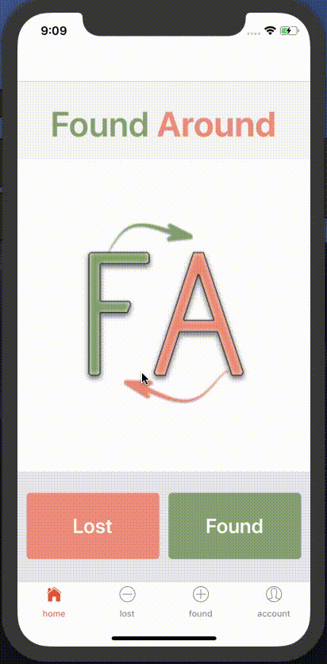

#HackATL Found Around Mobile App

This mobile app prototype was made for HackATL 2018 using React Native. The app is for a lost-and-found platform for Emory University.

## Demo


For better quality, you can watch the file DEMO_lfmobile.mov


To personally see the app in action, follow the steps below:

## Installation

Install [Node.js](https://nodejs.org/) (>=8.12.0).

Install [Expo CLI](https://expo.io/tools) (>= 2.2.0) by running the following command:

```bash
npm install -g expo-cli
```

##Usage

To run the app, go to the terminal and run the command:

```bash
expo-cli start
```

You can press a for Android emulator or i for iOS simulator (iOS with Phone X is recommended).

Documentation for how to run the app can be found [here](https://docs.expo.io/versions/latest/workflow/up-and-running/)